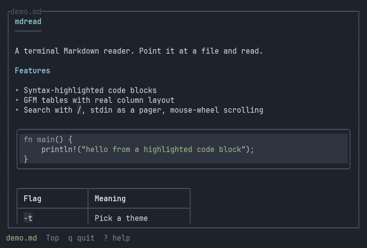

# mdread

A terminal Markdown reader. Point it at a file and read it properly — real
tables, highlighted code, and text set at a width you can actually read.



*(Recorded from a real session by `assets/record-demo.py`, which drives the
binary in a pseudo-terminal and renders each frame.)*

## Why

`glow` and `mdcat` render a single document well but have no notion of a
document tree. `frogmouth` browses a tree but renders plainly. `mdread` is
aiming at both: render quality first, then a docs browser on top of it.

Today it does the first half, plus the reading essentials on top of it:
search, stdin, and the mouse wheel.

## Install

Prebuilt binaries for Linux, macOS, and Windows are attached to each
[release](https://github.com/vekariaayush04/mdread/releases/latest).
The one-line installers put `mdread` on your PATH:

```sh
# Linux and macOS
curl --proto '=https' --tlsv1.2 -LsSf https://github.com/vekariaayush04/mdread/releases/latest/download/mdread-installer.sh | sh
```

```powershell
# Windows
powershell -ExecutionPolicy Bypass -c "irm https://github.com/vekariaayush04/mdread/releases/latest/download/mdread-installer.ps1 | iex"
```

With Homebrew on macOS or Linux:

```sh
brew install vekariaayush04/tap/mdread
```

With a Rust toolchain (1.88 or newer), install from crates.io instead:

```sh
cargo install mdread
```

Or build from source:

```sh
git clone https://github.com/vekariaayush04/mdread
cd mdread
cargo install --path .
```

## Usage

```sh
mdread README.md
mdread --theme light docs/guide.md
mdread --max-measure 100 notes.md
cat CHANGELOG.md | mdread          # or: mdread < CHANGELOG.md
```

| Flag | Meaning |
|---|---|
| `-t`, `--theme <NAME>` | `dark`, `light`, or `high-contrast` |
| `--max-measure <COLS>` | Widest the text may become (default 80) |
| `--config <PATH>` | Use this config file instead of the default |

With no file argument mdread reads the document from stdin, so it works as a
pager: `git show --stat | mdread`. A piped document cannot be reloaded, so
`r` does nothing for it.

## Keys

| Key | Action |
|---|---|
| `j` / `↓` | Down a line |
| `k` / `↑` | Up a line |
| `d` / `u` | Half page down / up |
| `Space` / `PgDn` | Page down |
| `PgUp` | Page up |
| `g` / `G` | Top / bottom |
| `/` | Search the document (Enter runs it, Esc cancels) |
| `n` / `N` | Next / previous match |
| `r` | Reload from disk, keeping your place |
| `?` | Show the help overlay |
| `Esc` | Close the overlay, or clear the search |
| `q` / `Ctrl-C` | Quit |
| Mouse wheel | Scroll three lines |

`r` is handy while writing: edit in one window, reload in the other, keep
your scroll position.

Mouse reporting is on only for the wheel; clicks and drags are ignored. If
you need to select text with the mouse, hold your terminal's override key
(Shift in most terminals).

## Configuration

TOML at `~/.config/mdread/config.toml` on Linux. Every field is optional and
mdread runs fine with no config file at all.

```toml
# Colour theme: "dark", "light", or "high-contrast".
theme = "dark"

# The widest the document text may become, in columns. Text is centred
# within the pane at this measure.
max_measure = 80
```

Precedence, lowest to highest: built-in defaults, the config file, CLI flags.

## What works today

Headings, prose with emphasis and strikethrough, links, inline code, bullet
and ordered and task lists, nested lists, block quotes, thematic breaks, GFM
tables with per-column alignment, and syntax-highlighted fenced code blocks.
Text is centred at a configurable measure and re-wraps on resize without
losing your place. A missing file, bad theme name, or malformed config gives
you a clear message rather than a crash, and the terminal is always restored
— even on a panic.

Since 0.2: in-document search with `/`, `n`, and `N`, with every match
highlighted; reading from stdin so it works as a pager; and mouse-wheel
scrolling.

## Not there yet

A file tree, following links between documents with back/forward history, an
outline pane, cross-tree search, live reload, inline images, and diagram
rendering.

## Development

```sh
cargo test                                   # 303 tests, no terminal needed
cargo clippy --all-targets -- -D warnings
cargo fmt --check
cargo run --example screenshot               # regenerate the image above
```

Rendering is snapshot-tested with [`insta`](https://insta.rs). If you change
the renderer, run `INSTA_UPDATE=always cargo test`, then **read** the changed
`.snap` files before committing them — accepting a snapshot you haven't looked
at just locks in whatever was broken at the time.

## Licence

MIT. See [LICENSE](./LICENSE).
